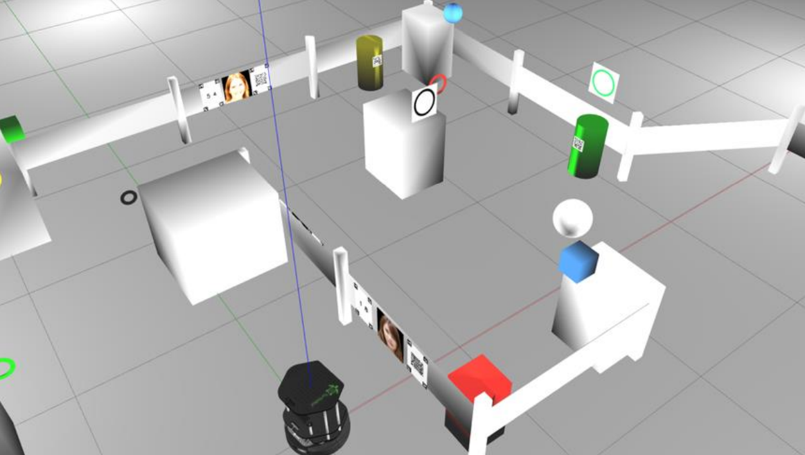
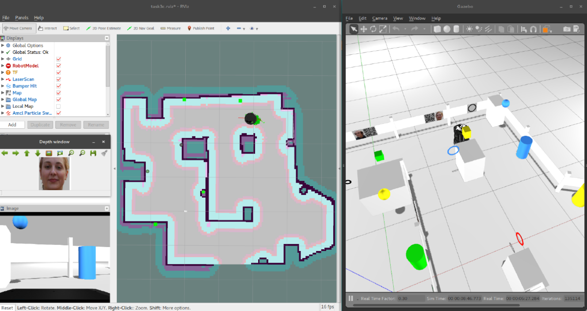

# TeamEpsilon

Authors: [Klemen Škrlj](https://github.com/klemen1999), [Aljoša Koren](https://github.com/aljkor), [Andrija Kuzmanov](https://github.com/super-nexus)

### Goal: 
Develop an intelligent robot system for Roomba using ROS

### Tasks:
System setup:
 - Running ROS
 - Tele-operating TurtleBot 

Autonomous navigation:
 - Autonomous control of the mobile platform
 - Acquiring images and 3D information
 - Simultaneous mapping and localization (SLAM)
 - Path planning, obstacle avoidance, approaching
 - Advanced fine manoeuvring (extend arm towards cylinder/rings)
 - Basic mobile manipulation
 - Intelligent navigation and exploration of space

Advanced perception and cognitive capabilities:
 - Detection of faces, digits, masks, 3D rings, 3D cylinders, colour and digit recognition
 - Training and using a classifier
 - Speech synthesis, speech recognition, dialogue processing (reading QR codes)
 - Belief maintenance, reasoning, planning

### Special acknowledgment
This project was choosen as the best overall

## How to run:
```
catkin_make
roslaunch setup rins_run.launch
roslaunch setup rins_task3.launch
rosrun navigation move_robot.py
```

## Screenshots of the environment:



